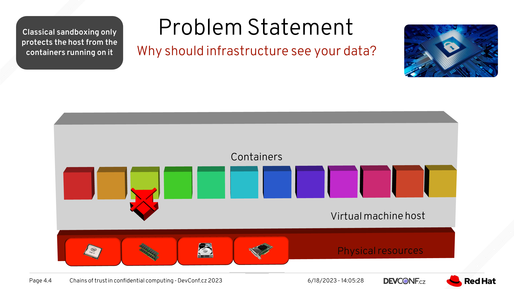
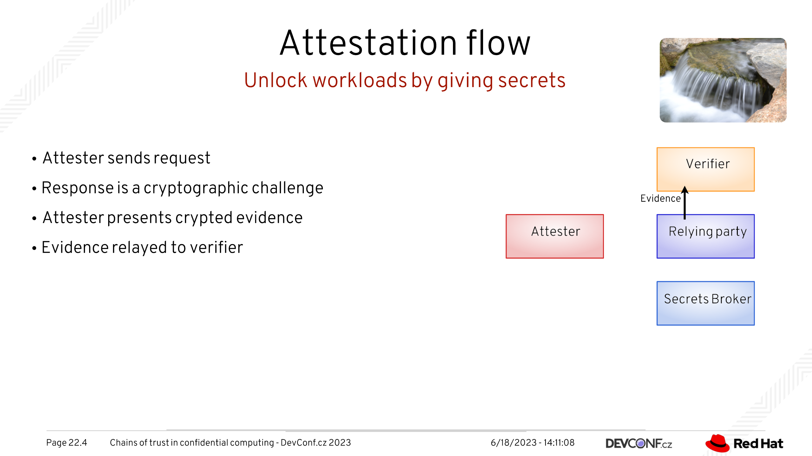

Chains of Trust in Confidential Computing
=========================================

This is a Tao3D presentation given at [DevConf.cz 2023][devconf2023] about
Confidential Computing attestation

Image and movie files not included (they don't belong on GitHub)

You can find Tao3D at https://tao3d.sourceforge.net but it is presently barely
functional, for reasons explained in [another talk][pedprojects]...

[devconf2023]: https://devconfcz2023.sched.com/event/1MYgP/chains-of-trust-in-confidential-computing

